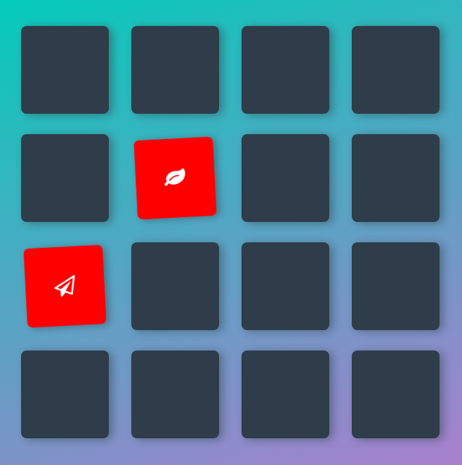
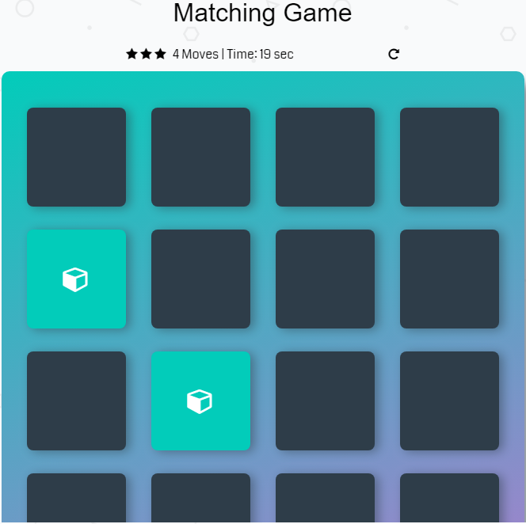
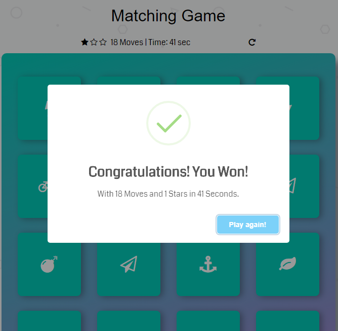

# Memory Game 

* Udacity Memory Game Project

## How to play

* Clicking on cards will turn them over so that you can see what lies on them.
* Your goal is to match two cards of the same type at a time.
* Then try to match all cards in as minimum moves as possible.

## Screenshot

* If cards do not match  

* If Cards Match  

* If all cards match, game ends  

## Built with 

* Html, Css, JavaScript

## External libraries Used

* Bootstrap
* Google Fonts
* Font Awesome
* Animate CSS
* Sweet Alert